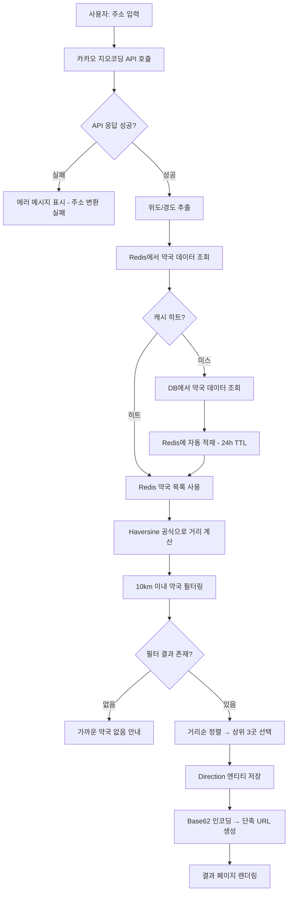
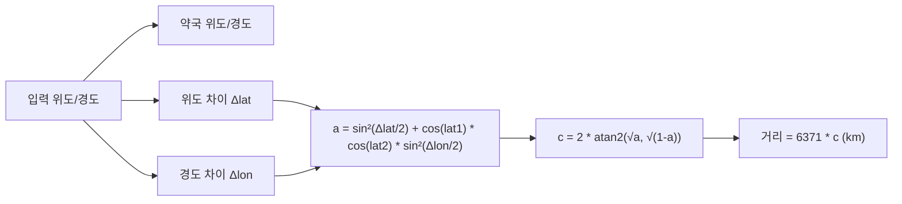
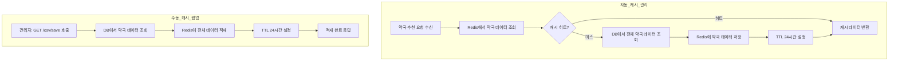
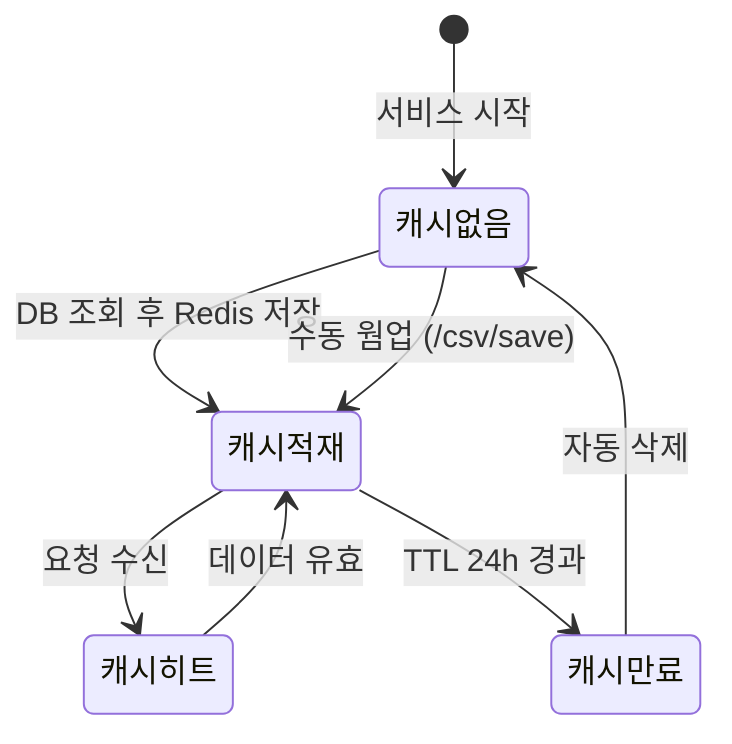
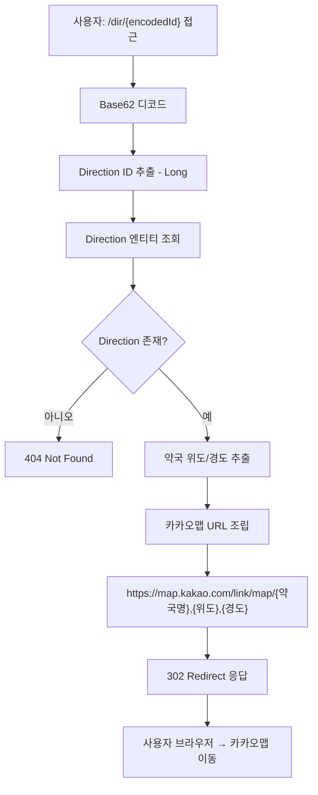
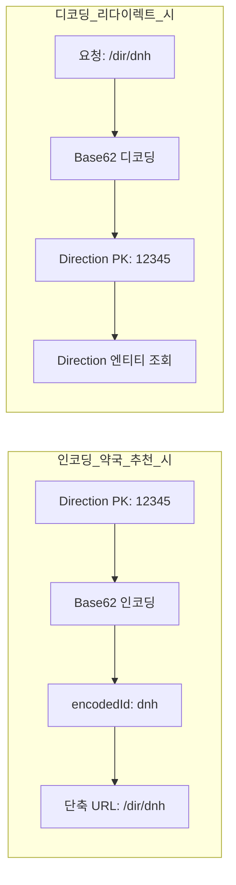

# 프로세스정의서 — 약국 추천 시스템

## 1. 약국 추천 프로세스

### 1.1 프로세스 개요

| 항목 | 내용 |
|------|------|
| 프로세스명 | 약국 추천 프로세스 |
| 트리거 | 사용자가 주소를 입력하고 "약국 찾기" 버튼 클릭 |
| 입력 | 도로명 주소 (문자열) |
| 출력 | 가장 가까운 약국 3곳 정보 + 카카오맵 단축 URL |
| 관련 API | 카카오 지오코딩 API, Redis, DB |

### 1.2 프로세스 흐름도

### 1.3 상세 처리 규칙

| 단계 | 처리 내용 | 비고 |
|------|-----------|------|
| 카카오 지오코딩 | `GET https://dapi.kakao.com/v2/local/search/address.json?query={주소}` | REST API KEY 헤더 인증 |
| Haversine 공식 | `d = 2r * arcsin(sqrt(sin²(Δlat/2) + cos(lat1)*cos(lat2)*sin²(Δlon/2)))` | 지구 반지름 6371km 사용 |
| 10km 필터 | 직선 거리 기준, 반경 10km 초과 약국 제외 | 설정값 변경 가능 |
| Direction 저장 | 입력 주소, 입력 위경도, 약국명, 약국 주소, 약국 위경도 | 추적/통계 목적 |
| Base62 인코딩 | Direction PK(Long) → Base62 문자열 | URL 단축 목적, 영문 대소문자+숫자 조합 |

### 1.4 Haversine 거리 계산 상세

---

## 2. 캐시 관리 프로세스

### 2.1 프로세스 개요

| 항목 | 내용 |
|------|------|
| 프로세스명 | 캐시 관리 프로세스 |
| 트리거 | 약국 추천 시 Redis 캐시 미스 또는 관리자 수동 호출 |
| 입력 | DB의 약국 데이터 |
| 출력 | Redis에 약국 데이터 적재 |
| 관련 기술 | Redis, Spring Data JPA |

### 2.2 프로세스 흐름도

### 2.3 상세 처리 규칙

| 단계 | 처리 내용 | 비고 |
|------|-----------|------|
| Redis 조회 | `RedisTemplate.opsForList()` 또는 Hash 구조 | 약국 전체 목록을 하나의 키로 관리 |
| DB Fallback | `PharmacyRepository.findAll()` | 캐시 미스 시 자동 실행 |
| Redis 적재 | 약국 ID, 이름, 주소, 위도, 경도 저장 | JSON 직렬화 |
| TTL | 24시간(86400초) | 만료 후 다음 요청 시 자동 재적재 |
| 수동 웜업 | 서비스 초기 기동 또는 데이터 갱신 시 사용 | `/csv/save` 엔드포인트 |

### 2.4 캐시 상태 다이어그램

---

## 3. 방향 리다이렉트 프로세스

### 3.1 프로세스 개요

| 항목 | 내용 |
|------|------|
| 프로세스명 | 방향 리다이렉트 프로세스 |
| 트리거 | 사용자가 결과 페이지에서 카카오맵 링크 클릭 |
| 입력 | Base62 인코딩된 Direction ID |
| 출력 | 카카오맵 URL로 302 리다이렉트 |

### 3.2 프로세스 흐름도

### 3.3 상세 처리 규칙

| 단계 | 처리 내용 | 비고 |
|------|-----------|------|
| Base62 디코드 | encodedId 문자열 → Long 타입 PK 변환 | `[0-9a-zA-Z]` 62개 문자 사용 |
| Direction 조회 | `DirectionRepository.findById(id)` | 없으면 404 반환 |
| URL 조립 | 약국명, 위도, 경도를 카카오맵 URL 템플릿에 삽입 | URL 인코딩 처리 |
| 리다이렉트 | HTTP 302 Found, Location 헤더에 카카오맵 URL | 브라우저가 자동 이동 |

### 3.4 Base62 인코딩/디코딩 흐름

