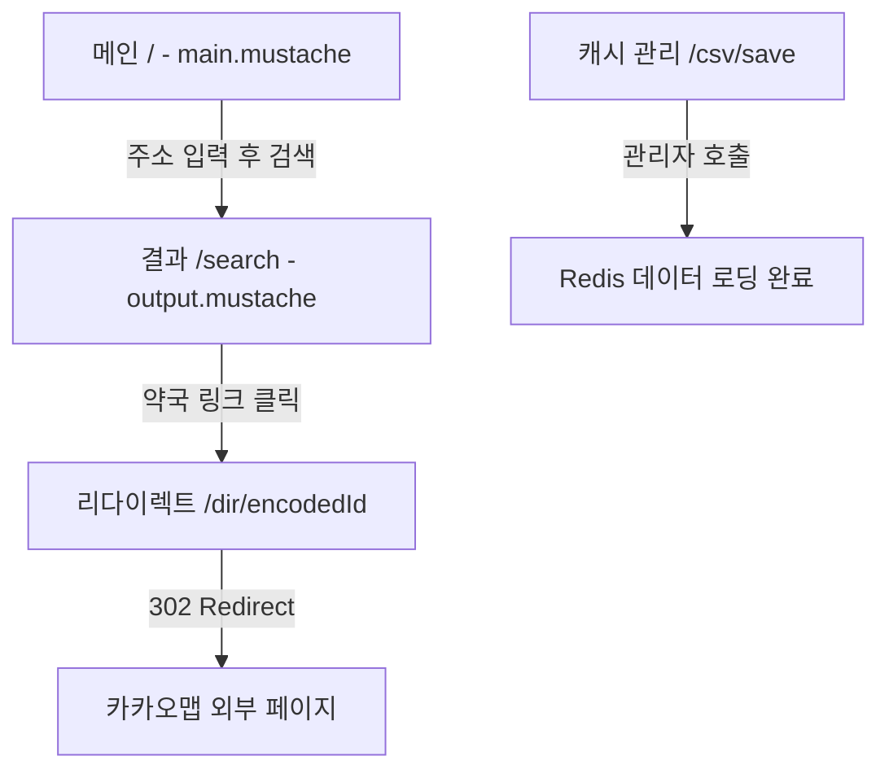
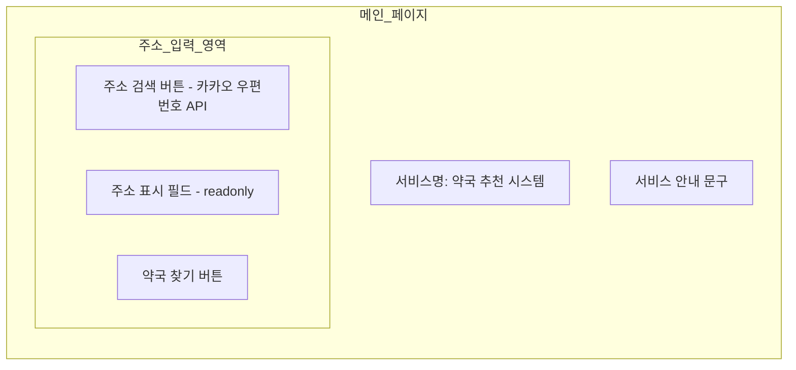
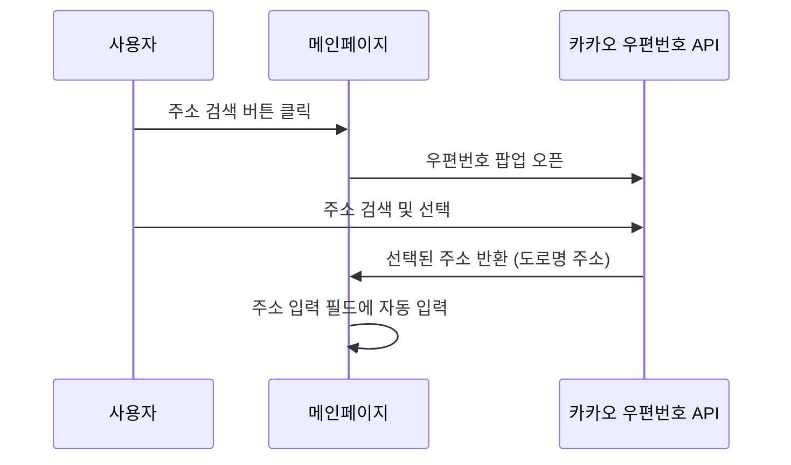
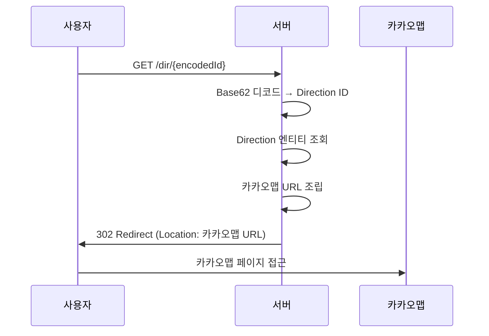
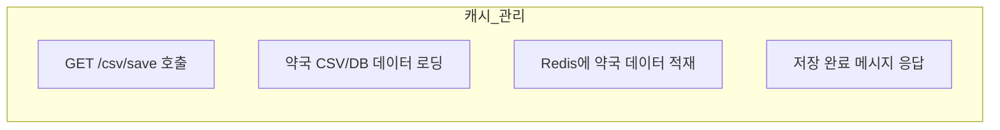

# 화면설계서 — 약국 추천 시스템

## 1. 전체 화면 구조



---

## 2. 페이지별 화면 설계

### 2.1 메인 페이지 (`/`) — main.mustache

- **템플릿**: Mustache
- **URL**: `/`
- **외부 연동**: 카카오 우편번호 API (Daum Postcode)



| 요소 | 타입 | 설명 |
|------|------|------|
| 주소 검색 버튼 | `button` | 카카오 우편번호 API 팝업 호출 (`daum.Postcode`) |
| 주소 표시 필드 | `input[text]` (readonly) | 선택된 주소 자동 입력, 직접 수정 불가 |
| 약국 찾기 버튼 | `button[submit]` | `GET /search?address={주소}` — 결과 페이지로 이동 |

#### 카카오 우편번호 API 연동 흐름



---

### 2.2 결과 페이지 (`/search`) — output.mustache

- **템플릿**: Mustache
- **URL**: `/search?address={주소}`
- **데이터**: 가까운 약국 최대 3곳

```mermaid
graph TB
    subgraph 결과_페이지
        direction TB
        HEADER[입력한 주소 표시]
        subgraph 약국_결과_테이블
            direction TB
            TH[약국명 | 주소 | 거리 | 카카오맵 | 로드뷰]
            TR1[OO약국 | 서울시 ... | 0.3km | 지도 링크 | 로드뷰 링크]
            TR2[XX약국 | 서울시 ... | 0.8km | 지도 링크 | 로드뷰 링크]
            TR3[ZZ약국 | 서울시 ... | 1.2km | 지도 링크 | 로드뷰 링크]
        end
        BACK[다시 검색하기 버튼]
    end
```

| 요소 | 타입 | 설명 |
|------|------|------|
| 입력 주소 | `h2` | 사용자가 입력한 검색 주소 표시 |
| 약국명 | `td` | 약국 이름 |
| 주소 | `td` | 약국 도로명 주소 |
| 거리 | `td` | Haversine 공식으로 계산된 직선 거리 (km) |
| 카카오맵 링크 | `a` | `/dir/{encodedId}` — Base62 인코딩된 단축 URL |
| 로드뷰 링크 | `a` | 카카오맵 로드뷰 URL 직접 링크 |
| 다시 검색하기 | `button` | `/` 메인 페이지로 이동 |

---

### 2.3 리다이렉트 (`/dir/{encodedId}`)

- **URL**: `/dir/{encodedId}`
- **화면 없음**: 302 리다이렉트 전용



| 항목 | 설명 |
|------|------|
| encodedId | Direction PK를 Base62로 인코딩한 문자열 |
| 카카오맵 URL | `https://map.kakao.com/link/map/{약국명},{위도},{경도}` |
| HTTP 상태코드 | 302 Found |

---

### 2.4 캐시 관리 (`/csv/save`)

- **URL**: `/csv/save`
- **접근**: 관리용 엔드포인트 (내부 사용)



| 항목 | 설명 |
|------|------|
| 용도 | 약국 데이터를 Redis에 사전 로딩 (웜업) |
| 응답 | 저장된 약국 수 또는 완료 메시지 |
| 비고 | 서비스 초기 기동 시 또는 데이터 갱신 시 수동 호출 |

---

## 3. 화면 흐름도 (전체)

```mermaid
flowchart TD
    START((시작)) --> MAIN[메인 페이지]
    MAIN -->|주소 검색 버튼| KAKAO_POPUP[카카오 우편번호 팝업]
    KAKAO_POPUP -->|주소 선택| MAIN
    MAIN -->|약국 찾기| RESULT[결과 페이지]
    RESULT -->|카카오맵 링크| REDIRECT[/dir/encodedId]
    REDIRECT -->|302| KAKAOMAP[카카오맵 외부]
    RESULT -->|로드뷰 링크| ROADVIEW[카카오맵 로드뷰 외부]
    RESULT -->|다시 검색하기| MAIN
    ADMIN[관리자] -->|캐시 웜업| CSV[/csv/save]
    CSV -->|Redis 적재 완료| ADMIN
```
