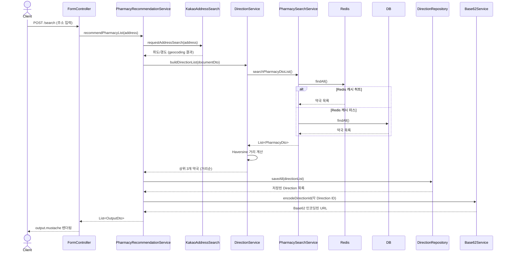
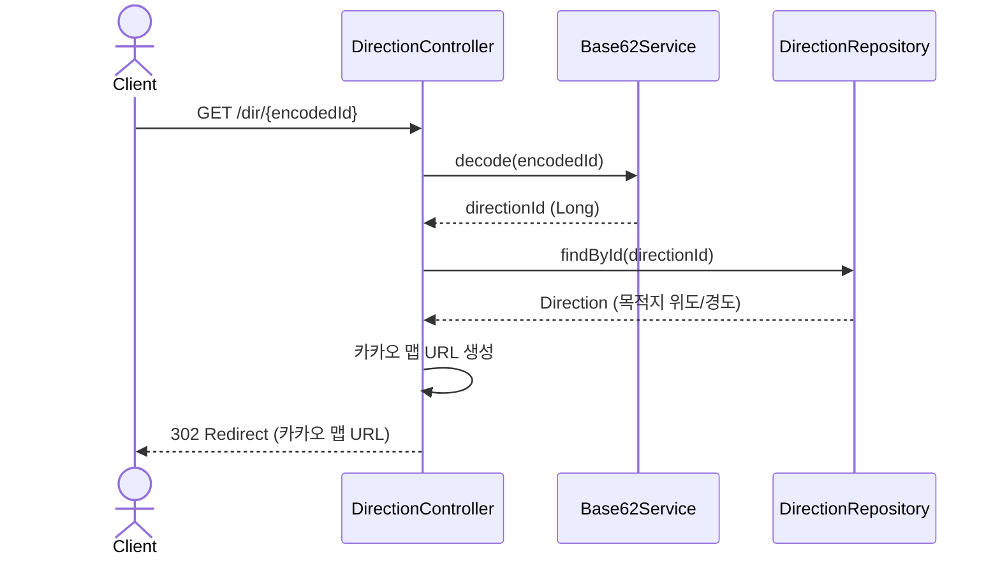
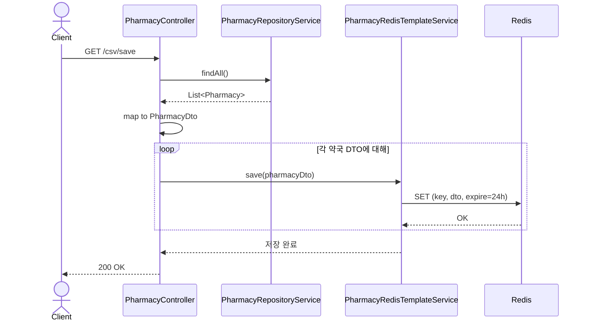
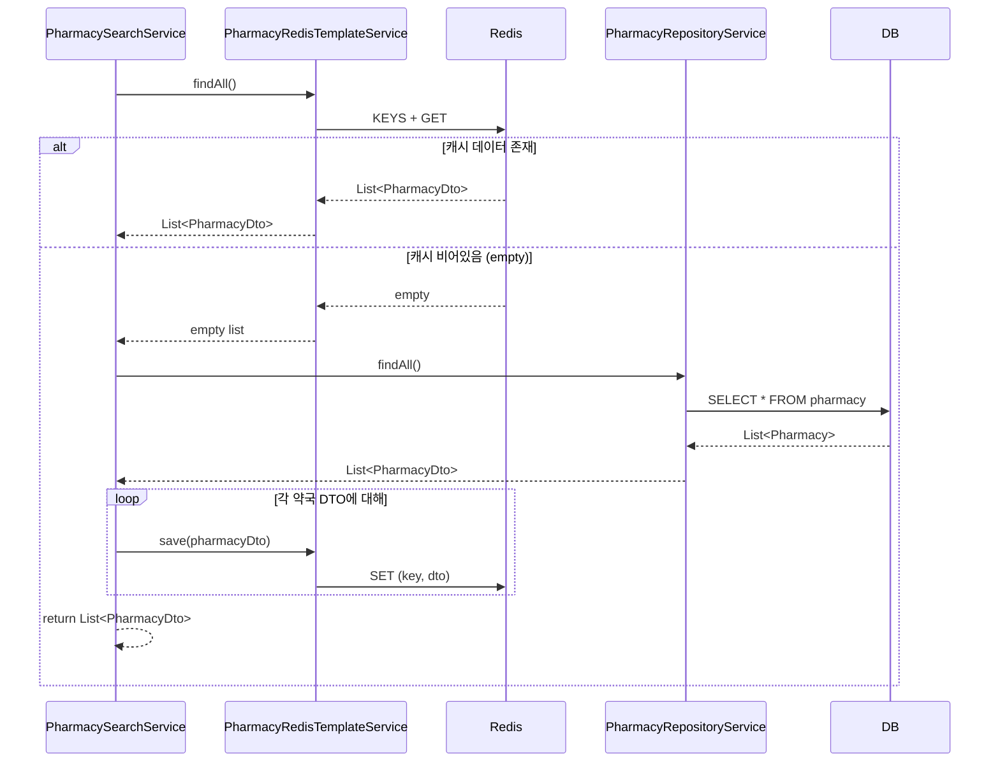

# 시퀀스 다이어그램

## 1. 약국 추천 플로우

```mermaid
sequenceDiagram
    actor Client
    participant FC as FormController
    participant PRS as PharmacyRecommendationService
    participant KAS as KakaoAddressSearch
    participant DS as DirectionService
    participant PSS as PharmacySearchService
    participant Redis
    participant DB
    participant DR as DirectionRepository
    participant B62 as Base62Service

    Client->>FC: POST /search (주소 입력)
    FC->>PRS: recommendPharmacyList(address)
    PRS->>KAS: requestAddressSearch(address)
    KAS-->>PRS: 위도/경도 (geocoding 결과)
    PRS->>DS: buildDirectionList(documentDto)
    DS->>PSS: searchPharmacyDtoList()
    PSS->>Redis: findAll()
    alt Redis 캐시 히트
        Redis-->>PSS: 약국 목록
    else Redis 캐시 미스
        PSS->>DB: findAll()
        DB-->>PSS: 약국 목록
    end
    PSS-->>DS: List<PharmacyDto>
    DS->>DS: Haversine 거리 계산
    DS-->>PRS: 상위 3개 약국 (거리순)
    PRS->>DR: saveAll(directionList)
    DR-->>PRS: 저장된 Direction 목록
    PRS->>B62: encodeDirectionId(각 Direction ID)
    B62-->>PRS: Base62 인코딩된 URL
    PRS-->>FC: List<OutputDto>
    FC-->>Client: output.mustache 렌더링
```

## 2. 방향 리다이렉트

```mermaid
sequenceDiagram
    actor Client
    participant DC as DirectionController
    participant B62 as Base62Service
    participant DR as DirectionRepository

    Client->>DC: GET /dir/{encodedId}
    DC->>B62: decode(encodedId)
    B62-->>DC: directionId (Long)
    DC->>DR: findById(directionId)
    DR-->>DC: Direction (목적지 위도/경도)
    DC->>DC: 카카오 맵 URL 생성
    DC-->>Client: 302 Redirect (카카오 맵 URL)
```

## 3. 캐시 로딩 (CSV 저장)

```mermaid
sequenceDiagram
    actor Client
    participant PC as PharmacyController
    participant PRS as PharmacyRepositoryService
    participant RTS as PharmacyRedisTemplateService
    participant Redis

    Client->>PC: GET /csv/save
    PC->>PRS: findAll()
    PRS-->>PC: List<Pharmacy>
    PC->>PC: map to PharmacyDto
    loop 각 약국 DTO에 대해
        PC->>RTS: save(pharmacyDto)
        RTS->>Redis: SET (key, dto, expire=24h)
        Redis-->>RTS: OK
    end
    RTS-->>PC: 저장 완료
    PC-->>Client: 200 OK
```

## 4. 캐시 자동 리로드

```mermaid
sequenceDiagram
    participant PSS as PharmacySearchService
    participant RTS as PharmacyRedisTemplateService
    participant Redis
    participant PRS as PharmacyRepositoryService
    participant DB

    PSS->>RTS: findAll()
    RTS->>Redis: KEYS + GET
    alt 캐시 데이터 존재
        Redis-->>RTS: List<PharmacyDto>
        RTS-->>PSS: List<PharmacyDto>
    else 캐시 비어있음 (empty)
        Redis-->>RTS: empty
        RTS-->>PSS: empty list
        PSS->>PRS: findAll()
        PRS->>DB: SELECT * FROM pharmacy
        DB-->>PRS: List<Pharmacy>
        PRS-->>PSS: List<PharmacyDto>
        loop 각 약국 DTO에 대해
            PSS->>RTS: save(pharmacyDto)
            RTS->>Redis: SET (key, dto)
        end
        PSS-->>PSS: return List<PharmacyDto>
    end
```
